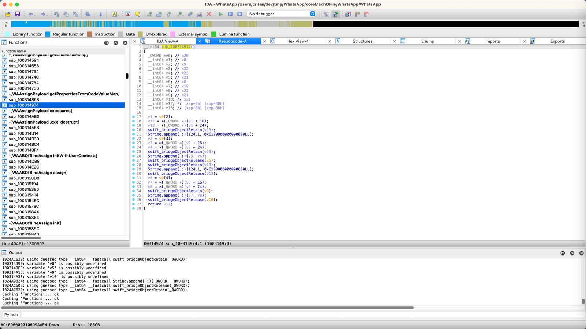
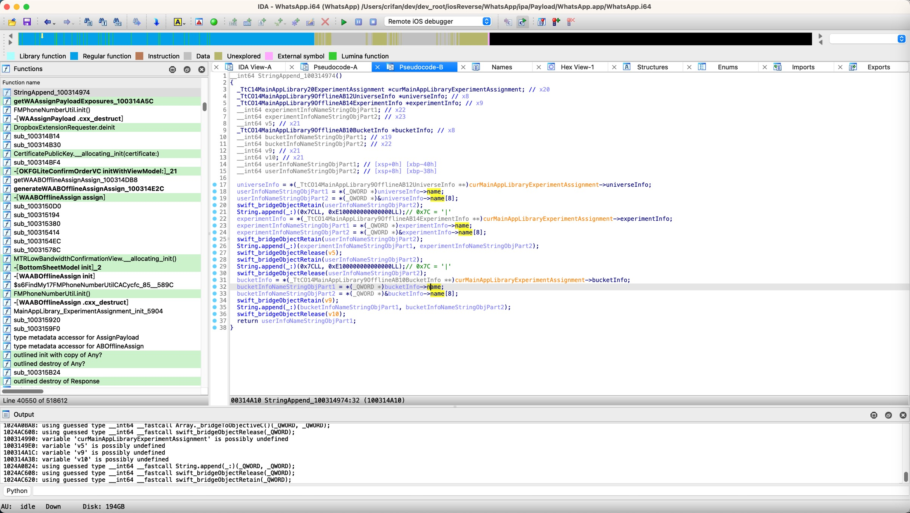

# 逆向前后对比

## 逆向之前

### IDA伪代码
最初的IDA的相关伪代码，优化之前，是：

```c
__int64 sub_100314974()
{
  _QWORD *v0; // x20
  __int64 v1; // x8
  __int64 v2; // x9
  __int64 v3; // x22
  __int64 v4; // x23
  __int64 v5; // x21
  __int64 v6; // x8
  __int64 v7; // x19
  __int64 v8; // x22
  __int64 v9; // x21
  __int64 v10; // x21
  __int64 v12; // [xsp+0h] [xbp-40h]
  __int64 v13; // [xsp+8h] [xbp-38h]


  v1 = v0[2];
  v12 = *(_QWORD *)(v1 + 16);
  v13 = *(_QWORD *)(v1 + 24);
  swift_bridgeObjectRetain(v13);
  String.append(_:)(124LL, 0xE100000000000000LL);
  v2 = v0[3];
  v3 = *(_QWORD *)(v2 + 16);
  v4 = *(_QWORD *)(v2 + 24);
  swift_bridgeObjectRetain(v13);
  String.append(_:)(v3, v4);
  swift_bridgeObjectRelease(v5);
  swift_bridgeObjectRetain(v13);
  String.append(_:)(124LL, 0xE100000000000000LL);
  swift_bridgeObjectRelease(v13);
  v6 = v0[4];
  v7 = *(_QWORD *)(v6 + 16);
  v8 = *(_QWORD *)(v6 + 24);
  swift_bridgeObjectRetain(v9);
  String.append(_:)(v7, v8);
  swift_bridgeObjectRelease(v10);
  return v12;
}
```



## 逆向后

### IDA伪代码

逆向后，经过分析，优化之后的：IDA伪代码：

```c
__int64 StringAppend_100314974()
{
  _TtC14MainAppLibrary20ExperimentAssignment *curMainAppLibraryExperimentAssignment; // x20
  _TtCO14MainAppLibrary9OfflineAB12UniverseInfo *universeInfo; // x8
  _TtCO14MainAppLibrary9OfflineAB14ExperimentInfo *experimentInfo; // x9
  __int64 experimentInfoNameStringObjPart1; // x22
  __int64 experimentInfoNameStringObjPart2; // x23
  __int64 v5; // x21
  _TtCO14MainAppLibrary9OfflineAB10BucketInfo *bucketInfo; // x8
  __int64 bucketInfoNameStringObjPart1; // x19
  __int64 bucketInfoNameStringObjPart2; // x22
  __int64 v9; // x21
  __int64 v10; // x21
  __int64 userInfoNameStringObjPart1; // [xsp+0h] [xbp-40h]
  __int64 userInfoNameStringObjPart2; // [xsp+8h] [xbp-38h]


  universeInfo = *(_TtCO14MainAppLibrary9OfflineAB12UniverseInfo **)curMainAppLibraryExperimentAssignment->universeInfo;
  userInfoNameStringObjPart1 = *(_QWORD *)universeInfo->name;
  userInfoNameStringObjPart2 = *(_QWORD *)&universeInfo->name[8];
  swift_bridgeObjectRetain(userInfoNameStringObjPart2);
  String.append(_:)(0x7CLL, 0xE100000000000000LL);// 0x7C = '|'
  experimentInfo = *(_TtCO14MainAppLibrary9OfflineAB14ExperimentInfo **)curMainAppLibraryExperimentAssignment->experimentInfo;
  experimentInfoNameStringObjPart1 = *(_QWORD *)experimentInfo->name;
  experimentInfoNameStringObjPart2 = *(_QWORD *)&experimentInfo->name[8];
  swift_bridgeObjectRetain(userInfoNameStringObjPart2);
  String.append(_:)(experimentInfoNameStringObjPart1, experimentInfoNameStringObjPart2);
  swift_bridgeObjectRelease(v5);
  swift_bridgeObjectRetain(userInfoNameStringObjPart2);
  String.append(_:)(0x7CLL, 0xE100000000000000LL);// 0x7C = '|'
  swift_bridgeObjectRelease(userInfoNameStringObjPart2);
  bucketInfo = *(_TtCO14MainAppLibrary9OfflineAB10BucketInfo **)curMainAppLibraryExperimentAssignment->bucketInfo;
  bucketInfoNameStringObjPart1 = *(_QWORD *)bucketInfo->name;
  bucketInfoNameStringObjPart2 = *(_QWORD *)&bucketInfo->name[8];
  swift_bridgeObjectRetain(v9);
  String.append(_:)(bucketInfoNameStringObjPart1, bucketInfoNameStringObjPart2);
  swift_bridgeObjectRelease(v10);
  return userInfoNameStringObjPart1;
}
```



### 代码逻辑

经过分析和调试，以及代码优化后，就真正的，完全的，彻底的搞懂了代码逻辑。

然后就可以分析和整理出函数的逻辑了：

* `StringAppend_100314974`
  * 输入：`MainAppLibrary.ExperimentAssignment`的实例
  * 处理过程
    * 获取`MainAppLibrary.ExperimentAssignment`的`universeInfo`
      * 再获取`universeInfo`的`name`
        * 其是`Swift`的（Native）`Large String`
    * 去拼接上：`"|"`
      * 其是个`Swift`的`small string`
    * 继续类似逻辑
      * 获取`MainAppLibrary.ExperimentAssignment`的`experimentInfo`
        * 再获取`experimentInfo`的`name`
          * 其是`Swift`的`Large String`
      * 拼接`"|"`
      * 获取`MainAppLibrary.ExperimentAssignment`的`bucketInfo`
        * 再获取`bucketInfo`的`name`
          * 其是`Swift`的`Small String`
    * 最终得到拼接后的最终的字符串
  * 处理逻辑概述：用`universeInfo`、`experimentInfo`、`bucketInfo`的`name`，中间加上`|`，拼接后的字符串
  * 输出=返回值：
    * 最终拼接后的字符串
    * 举例
      * `"dummy_aa_offline_rid_universe_ios|dummy_aa_offline_rid_experiment_ios|control"`

如此，实现了：

通过静态分析（IDA的汇编代码和伪代码、class-dump导出的头文件、导出的字符串等资源）和动态调试（Xcode、lldb、iOSOpenDev插件hook代码等），加上此处特定的，Swift的String的Append函数以及String的内部类型和逻辑（String分Small String和Large String），最终才彻底搞懂代码逻辑，以及去优化IDA伪代码为，最终的代码，人类能看懂的代码。
