# 逆向过程

现在开始具体说明：

WhatsApp中的函数，二进制内函数偏移量地址是：`0x100314974`

最开始，用IDA打开并自动分析后，去查看IDA伪代码是：

* sub_100314974

```c
__int64 sub_100314974()
{
  _QWORD *v0; // x20
  __int64 v1; // x8
  __int64 v2; // x9
  __int64 v3; // x22
  __int64 v4; // x23
  __int64 v5; // x21
  __int64 v6; // x8
  __int64 v7; // x19
  __int64 v8; // x22
  __int64 v9; // x21
  __int64 v10; // x21
  __int64 v12; // [xsp+0h] [xbp-40h]
  __int64 v13; // [xsp+8h] [xbp-38h]


  v1 = v0[2];
  v12 = *(_QWORD *)(v1 + 16);
  v13 = *(_QWORD *)(v1 + 24);
  swift_bridgeObjectRetain(v13);
  String.append(_:)(124LL, 0xE100000000000000LL);
  v2 = v0[3];
  v3 = *(_QWORD *)(v2 + 16);
  v4 = *(_QWORD *)(v2 + 24);
  swift_bridgeObjectRetain(v13);
  String.append(_:)(v3, v4);
  swift_bridgeObjectRelease(v5);
  swift_bridgeObjectRetain(v13);
  String.append(_:)(124LL, 0xE100000000000000LL);
  swift_bridgeObjectRelease(v13);
  v6 = v0[4];
  v7 = *(_QWORD *)(v6 + 16);
  v8 = *(_QWORD *)(v6 + 24);
  swift_bridgeObjectRetain(v9);
  String.append(_:)(v7, v8);
  swift_bridgeObjectRelease(v10);
  return v12;
}
```

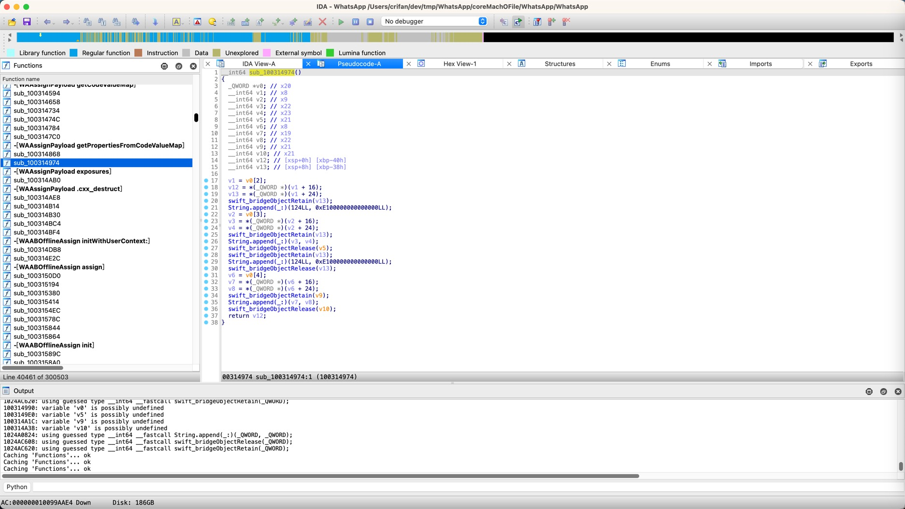

很明显，最开始的默认的IDA伪代码看不出此处函数的代码逻辑 =不知道函数具体是做什么的

然后，经过分析和调试，慢慢搞懂了代码逻辑，再回来给IDA伪代码中去优化改名：

* 函数名改名
  * sub_100314974 -> StringAppend_100314974
* 变量名改名
  * `v1` -> `universeInfo`
  * `v12` -> `userInfoNameStringObjPart1`
  * `v13` -> `userInfoNameStringObjPart2`
  * `v2` -> `experimentInfo`
  * `v6` -> `bucketInfo`
  * ...
* 加上注释
  * 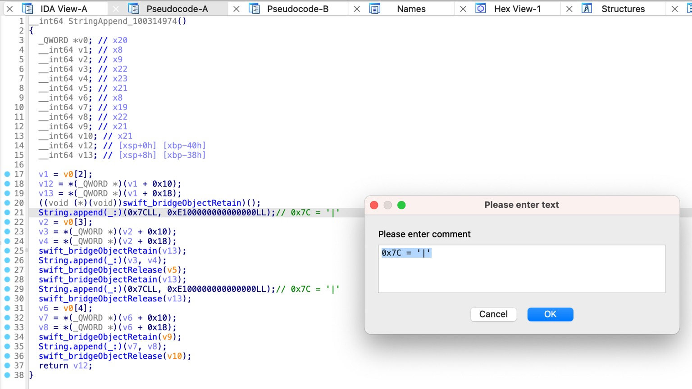

然后才能慢慢搞懂，逐渐的彻底搞懂代码的全部逻辑

接着去解释中间是，如何：

* 静态分析

* 动态调试

的。

先去动态调试代码逻辑：

此时先要搞清楚：

传入的参数值：

且通过后续研究，比如查看IDA的汇编代码：

```asm
__text:0000000100314974 sub_100314974                           ; CODE XREF: sub_100314868+B4↑p
__text:0000000100314974
__text:0000000100314974 var_40          = -0x40
__text:0000000100314974 var_30          = -0x30
__text:0000000100314974 var_20          = -0x20
__text:0000000100314974 var_10          = -0x10
__text:0000000100314974 var_s0          =  0
__text:0000000100314974
__text:0000000100314974                 SUB             SP, SP, #0x50
__text:0000000100314978                 STP             X24, X23, [SP,#0x40+var_30]
__text:000000010031497C                 STP             X22, X21, [SP,#0x40+var_20]
__text:0000000100314980                 STP             X20, X19, [SP,#0x40+var_10]
__text:0000000100314984                 STP             X29, X30, [SP,#0x40+var_s0]
__text:0000000100314988                 ADD             X29, SP, #0x40
__text:000000010031498C                 MOV             X19, X20
__text:0000000100314990                 LDR             X8, [X20,#0x10]
__text:0000000100314994                 LDP             X9, X0, [X8,#0x10]
__text:0000000100314998                 STP             X9, X0, [SP,#0x40+var_40]
__text:000000010031499C                 BL              _swift_bridgeObjectRetain
__text:00000001003149A0                 MOV             X20, SP
__text:00000001003149A4                 MOV             W0, #0x7C ; '|'
__text:00000001003149A8                 MOV             X1, #0xE100000000000000
__text:00000001003149AC                 BL              _$sSS6appendyySSF ; String.append(_:)
__text:00000001003149B0                 LDP             X8, X21, [SP,#0x40+var_40]
__text:00000001003149B4                 LDR             X9, [X19,#0x18]
__text:00000001003149B8                 LDP             X22, X23, [X9,#0x10]
__text:00000001003149BC                 STP             X8, X21, [SP,#0x40+var_40]
__text:00000001003149C0                 MOV             X0, X21
__text:00000001003149C4                 BL              _swift_bridgeObjectRetain
__text:00000001003149C8                 MOV             X20, SP
__text:00000001003149CC                 MOV             X0, X22
__text:00000001003149D0                 MOV             X1, X23
__text:00000001003149D4                 BL              _$sSS6appendyySSF ; String.append(_:)
__text:00000001003149D8                 LDP             X20, X22, [SP,#0x40+var_40]
__text:00000001003149DC                 MOV             X0, X21
__text:00000001003149E0                 BL              _swift_bridgeObjectRelease
__text:00000001003149E4                 STP             X20, X22, [SP,#0x40+var_40]
__text:00000001003149E8                 MOV             X0, X22
__text:00000001003149EC                 BL              _swift_bridgeObjectRetain
__text:00000001003149F0                 MOV             X20, SP
__text:00000001003149F4                 MOV             W0, #0x7C ; '|'
__text:00000001003149F8                 MOV             X1, #0xE100000000000000
__text:00000001003149FC                 BL              _$sSS6appendyySSF ; String.append(_:)
__text:0000000100314A00                 LDP             X20, X21, [SP,#0x40+var_40]
__text:0000000100314A04                 MOV             X0, X22
__text:0000000100314A08                 BL              _swift_bridgeObjectRelease
__text:0000000100314A0C                 LDR             X8, [X19,#0x20]
__text:0000000100314A10                 LDP             X19, X22, [X8,#0x10]
__text:0000000100314A14                 STP             X20, X21, [SP,#0x40+var_40]
__text:0000000100314A18                 MOV             X0, X21
__text:0000000100314A1C                 BL              _swift_bridgeObjectRetain
__text:0000000100314A20                 MOV             X20, SP
__text:0000000100314A24                 MOV             X0, X19
__text:0000000100314A28                 MOV             X1, X22
__text:0000000100314A2C                 BL              _$sSS6appendyySSF ; String.append(_:)
__text:0000000100314A30                 LDP             X19, X20, [SP,#0x40+var_40]
__text:0000000100314A34                 MOV             X0, X21
__text:0000000100314A38                 BL              _swift_bridgeObjectRelease
__text:0000000100314A3C                 MOV             X0, X19
__text:0000000100314A40                 MOV             X1, X20
__text:0000000100314A44                 LDP             X29, X30, [SP,#0x40+var_s0]
__text:0000000100314A48                 LDP             X20, X19, [SP,#0x40+var_10]
__text:0000000100314A4C                 LDP             X22, X21, [SP,#0x40+var_20]
__text:0000000100314A50                 LDP             X24, X23, [SP,#0x40+var_30]
__text:0000000100314A54                 ADD             SP, SP, #0x50 ; 'P'
__text:0000000100314A58                 RET
__text:0000000100314A58 ; End of function sub_100314974
```


才搞清楚此处是特殊的：通过X20传递了参数的

而不是普通的，通过X0、X1、X2等寄存器传递参数的

然后去调试查看寄存器值：

```bash
(lldb) reg r x0 x1 x19 x20
      x0 = 0x000000016d658c90
      x1 = 0x00000002828d0780
     x19 = 0x00000002828d0780
     x20 = 0x00000002833c1140
(lldb) po $x20
MainAppLibrary.ExperimentAssignment
```

发现是：

* 类`MainAppLibrary.ExperimentAssignment`

后续确认，是个：Swift的类，而不是普通的ObjC的类

如此，想要搞清楚，该类的具体细节，比如有哪些属性（字段）和函数等等，就无法直接查看到

然后需要去通过分析才能找到。

经过：

* 用class-dump导出的头文件
  * 详见
    * [class-dump · iOS逆向开发：静态分析](https://book.crifan.org/books/ios_re_static_analysis/website/analysis_content/export_header/class_dump/)
  * 找到类的字段=属性名称
* 导出的静态字符串等资源
  * 详见
    * [查看信息和导出字符串 · iOS逆向开发：静态分析](https://book.crifan.org/books/ios_re_static_analysis/website/analysis_examples/bin_info_exp_str.html)
* IDA中类的定义
  * 找到类的字段=属性，以及具体的偏移量定义 

最后找到了：

之前导出的头文件中，搜：

`MainAppLibrary\d+ExperimentAssignment`

找到的：

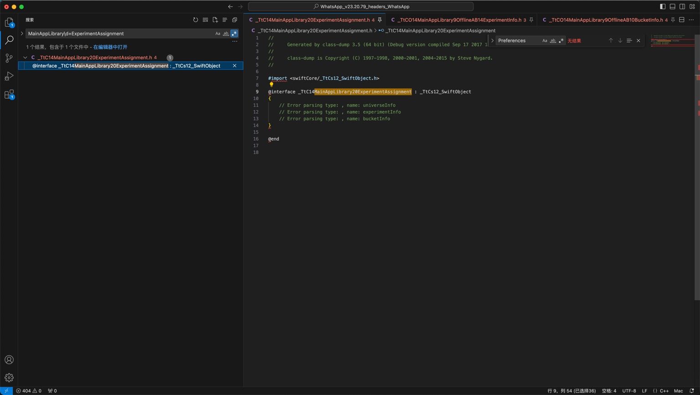

* /Users/crifan/dev/dev_root/iosReverse/WhatsApp/headers/WhatsApp_v23.20.79_headers_WhatsApp/_TtC14MainAppLibrary20ExperimentAssignment.h

```c
//
//     Generated by class-dump 3.5 (64 bit) (Debug version compiled Sep 17 2017 16:24:48).
//
//     class-dump is Copyright (C) 1997-1998, 2000-2001, 2004-2015 by Steve Nygard.
//

#import <swiftCore/_TtCs12_SwiftObject.h>

@interface _TtC14MainAppLibrary20ExperimentAssignment : _TtCs12_SwiftObject
{
    // Error parsing type: , name: universeInfo
    // Error parsing type: , name: experimentInfo
    // Error parsing type: , name: bucketInfo
}

@end
```
-》能看出：

* 类`_TtC14MainAppLibrary20ExperimentAssignment`
  * 有3个属性
    * `universeInfo`
    * `experimentInfo`
    * `bucketInfo`

但是具体内部偏移量，不清楚。

然后去找

* 类`_TtC14MainAppLibrary20ExperimentAssignment`

然后通过之前导出的静态字符串资源中，搜索

`MainAppLibrary\d+ExperimentAssignment`

而找到的：

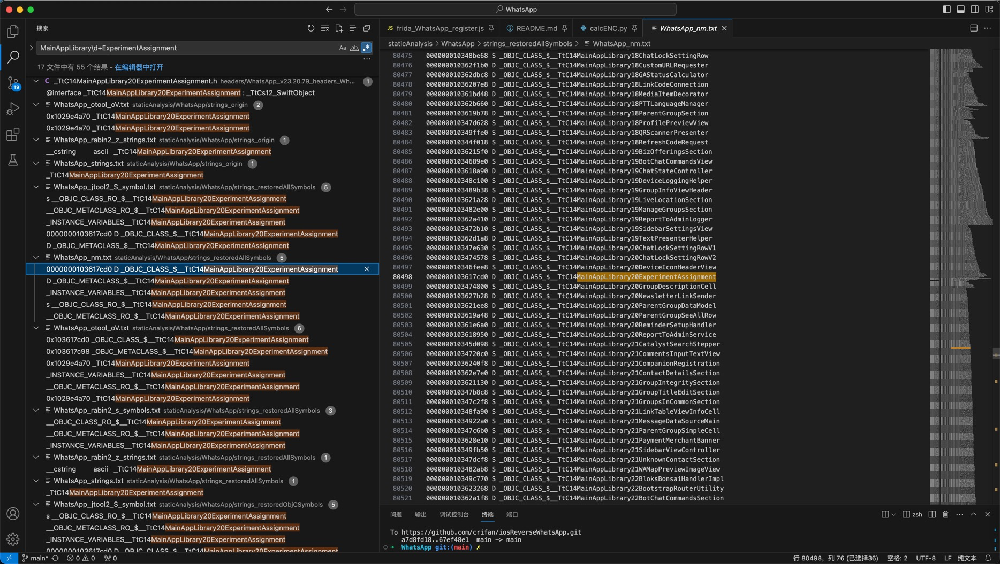

* /Users/crifan/dev/dev_root/iosReverse/WhatsApp/staticAnalysis/WhatsApp/strings_restoredAllSymbols/WhatsApp_nm.txt

```c
0000000103617cd0 D _OBJC_CLASS_$__TtC14MainAppLibrary20ExperimentAssignment
```

* /Users/crifan/dev/dev_root/iosReverse/WhatsApp/staticAnalysis/WhatsApp/strings_restoredAllSymbols/WhatsApp_otool_oV.txt

```c
00000001030a7aa8 0x103617cd0 _OBJC_CLASS_$__TtC14MainAppLibrary20ExperimentAssignment
    isa        0x103617c98 _OBJC_METACLASS_$__TtC14MainAppLibrary20ExperimentAssignment
    superclass 0x0 _OBJC_CLASS_$__TtCs12_SwiftObject
...
    data       0x1030dfe79 Swift class
...
        name           0x1029e4a70 _TtC14MainAppLibrary20ExperimentAssignment
...
        ivars          0x1030dfe10 __OBJC_$_INSTANCE_VARIABLES__TtC14MainAppLibrary20ExperimentAssignment
```

找到了：

* `OBJC_CLASS____TtC14MainAppLibrary20ExperimentAssignment`

然后去IDA中看看：

* `OBJC_CLASS____TtC14MainAppLibrary20ExperimentAssignment`
  * 偏移量=地址：`0x103617cd0`

而找到

```asm
__data:0000000103617CD0 _OBJC_CLASS_$__TtC14MainAppLibrary20ExperimentAssignment __objc2_class <_OBJC_METACLASS_$__TtC14MainAppLibrary20ExperimentAssignment,\
__data:0000000103617CD0                                         ; DATA XREF: type metadata accessor for ExperimentAssignment+4↑o
__data:0000000103617CD0                                         ; __objc_classlist:00000001030A7AA8↑o
__data:0000000103617CD0                                _OBJC_CLASS_$__TtCs12_SwiftObject, __objc_empty_cache, \ ; ExperimentAssignment
__data:0000000103617CD0                                0, \
__data:0000000103617CD0                                _TtC14MainAppLibrary20ExperimentAssignment_$classData.flags+1>
__data:0000000103617CF8                 DCB    2
__data:0000000103617CF9                 DCB    0
__data:0000000103617CFA                 DCB    0
__data:0000000103617CFB                 DCB    0
__data:0000000103617CFC                 DCB    0
__data:0000000103617CFD                 DCB    0
__data:0000000103617CFE                 DCB    0
__data:0000000103617CFF                 DCB    0
__data:0000000103617D00                 DCB 0x28 ; (
__data:0000000103617D01                 DCB    0
__data:0000000103617D02                 DCB    0
__data:0000000103617D03                 DCB    0
__data:0000000103617D04                 DCB    7
__data:0000000103617D05                 DCB    0
__data:0000000103617D06                 DCB    0
__data:0000000103617D07                 DCB    0
__data:0000000103617D08                 DCB 0x80
__data:0000000103617D09                 DCB    0
__data:0000000103617D0A                 DCB    0
__data:0000000103617D0B                 DCB    0
__data:0000000103617D0C                 DCB 0x10
__data:0000000103617D0D                 DCB    0
__data:0000000103617D0E                 DCB    0
__data:0000000103617D0F                 DCB    0
__data:0000000103617D10                 DCQ $s14MainAppLibrary20ExperimentAssignmentCMn ; nominal type descriptor for ExperimentAssignment
__data:0000000103617D18                 ALIGN 0x20
__data:0000000103617D20                 DCB 0x10
__data:0000000103617D21                 DCB    0
```


继而找到：

```c
__data:0000000103617D10                 DCQ $s14MainAppLibrary20ExperimentAssignmentCMn ; nominal type descriptor for ExperimentAssignment
```

双击

* `$s14MainAppLibrary20ExperimentAssignmentCMn`

进去看到定义：

即：

* 类`MainAppLibrary.ExperimentAssignment`的具体定义

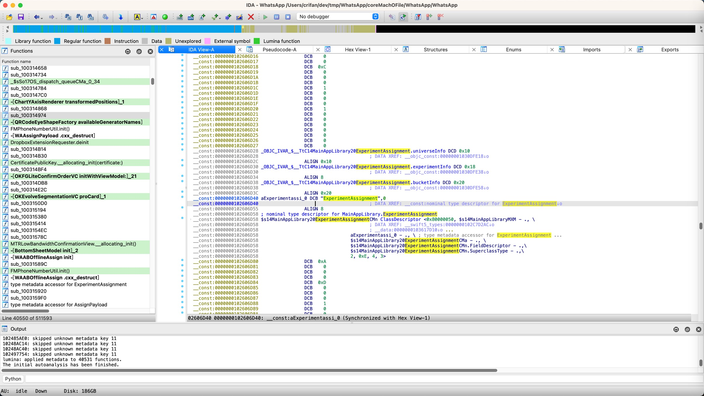

```asm
__const:0000000102606D27                 DCB    0
__const:0000000102606D28 _OBJC_IVAR_$__TtC14MainAppLibrary20ExperimentAssignment.universeInfo DCD 0x10
__const:0000000102606D28                                         ; DATA XREF: __objc_const:00000001030DFE18↓o
__const:0000000102606D2C                 ALIGN 0x10
__const:0000000102606D30 _OBJC_IVAR_$__TtC14MainAppLibrary20ExperimentAssignment.experimentInfo DCD 0x18
__const:0000000102606D30                                         ; DATA XREF: __objc_const:00000001030DFE38↓o
__const:0000000102606D34                 ALIGN 8
__const:0000000102606D38 _OBJC_IVAR_$__TtC14MainAppLibrary20ExperimentAssignment.bucketInfo DCD 0x20
__const:0000000102606D38                                         ; DATA XREF: __objc_const:00000001030DFE58↓o
__const:0000000102606D3C                 ALIGN 0x20
__const:0000000102606D40 aExperimentassi_0 DCB "ExperimentAssignment",0
__const:0000000102606D40                                         ; DATA XREF: __const:nominal type descriptor for ExperimentAssignment↓o
__const:0000000102606D55                 ALIGN 8
__const:0000000102606D58 ; nominal type descriptor for MainAppLibrary.ExperimentAssignment
__const:0000000102606D58 $s14MainAppLibrary20ExperimentAssignmentCMn ClassDescriptor <0x80000050, $s14MainAppLibraryMXM - ., \
__const:0000000102606D58                                         ; DATA XREF: __swift5_types:0000000102C7D2AC↓o
__const:0000000102606D58                                         ; __data:0000000103617D10↓o ...
__const:0000000102606D58                                  aExperimentassi_0 - ., \ ; type metadata accessor for ExperimentAssignment ...
__const:0000000102606D58                                  $s14MainAppLibrary20ExperimentAssignmentCMa - ., \
__const:0000000102606D58                                  $s14MainAppLibrary20ExperimentAssignmentCMn.FieldDescriptor - .,\
__const:0000000102606D58                                  $s14MainAppLibrary20ExperimentAssignmentCMn.SuperclassType - .,\
__const:0000000102606D58                                  2, 0xE, 4, 3>
__const:0000000102606D80                 DCB  0xA
__const:0000000102606D81                 DCB    0
```

此处其实就可以看出：

* `MainAppLibrary.ExperimentAssignment` == `_TtC14MainAppLibrary20ExperimentAssignment`
    * [+0x10] = `universeInfo`
    * [+0x18] = `experimentInfo`
    * [+0x20] = `bucketInfo`

后续去（Xcode调试中的lldb调试界面）查看内存中的数据，就是可以对得上的：

```bash
(lldb) x/8gx $x20
0x2833c1140: 0x0000000105dbbcd0 0x0000000200000003
0x2833c1150: 0x00000002819ecea0 0x00000002819ecf00
0x2833c1160: 0x00000002833b9b00 0x0000000000000000
0x2833c1170: 0x00000001efe1f820 0x0000000000000000
(lldb) po 0x0000000105dbbcd0
MainAppLibrary.ExperimentAssignment
(lldb) po 0x00000002819ecea0
MainAppLibrary.OfflineAB.UniverseInfo
(lldb) po 0x00000002819ecf00
MainAppLibrary.OfflineAB.ExperimentInfo
(lldb) po 0x00000002833b9b00
MainAppLibrary.OfflineAB.BucketInfo
```

如此，即可推断和确认和计算出此处的值：

* `MainAppLibrary.ExperimentAssignment` == `0x00000002833c1140` == `0x2833c1140`
  * [+0x10] = `universeInfo`
    * `0x00000002819ecea0`
  * [+0x18] = `experimentInfo`
    * `0x00000002819ecf00`
  * [+0x20] = `bucketInfo`
    * `0x00000002833b9b00`

而至此，理论上，其实可以通过：

IDA汇编代码 + IDA伪代码

能看出：

```c
  v1 = v0[2];

  v2 = v0[3];

  v6 = v0[4];
```

==

```asm
__text:0000000100314990                 LDR             X8, [X20,#0x10]

__text:00000001003149B4                 LDR             X9, [X19,#0x18]

__text:0000000100314A0C                 LDR             X8, [X19,#0x20]
```

其实就分别对应着上面的：

* `[+0x10] = universeInfo`
  * `0x00000002819ecea0`
* `[+0x18] = experimentInfo`
  * `0x00000002819ecf00`
* `[+0x20] = bucketInfo`
  * `0x00000002833b9b00`

如此，即可去分别：

优化IDA伪代码，给变量重命名：


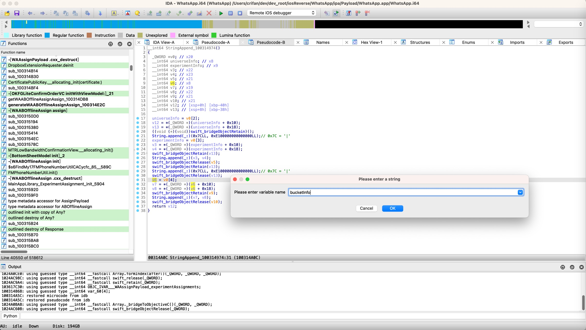

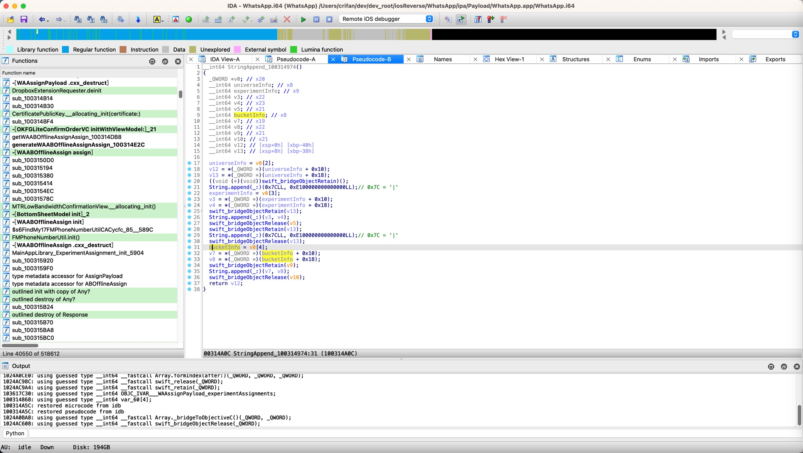

此时，IDA伪代码就变成了：

```c
__int64 StringAppend_100314974()
{
  _QWORD *v0; // x20
  __int64 universeInfo; // x8
  __int64 experimentInfo; // x9
  __int64 v3; // x22
  __int64 v4; // x23
  __int64 v5; // x21
  __int64 bucketInfo; // x8
  __int64 v7; // x19
  __int64 v8; // x22
  __int64 v9; // x21
  __int64 v10; // x21
  __int64 v12; // [xsp+0h] [xbp-40h]
  __int64 v13; // [xsp+8h] [xbp-38h]


  universeInfo = v0[2];
  v12 = *(_QWORD *)(universeInfo + 0x10);
  v13 = *(_QWORD *)(universeInfo + 0x18);
  ((void (*)(void))swift_bridgeObjectRetain)();
  String.append(_:)(0x7CLL, 0xE100000000000000LL);// 0x7C = '|'
  experimentInfo = v0[3];
  v3 = *(_QWORD *)(experimentInfo + 0x10);
  v4 = *(_QWORD *)(experimentInfo + 0x18);
  swift_bridgeObjectRetain(v13);
  String.append(_:)(v3, v4);
  swift_bridgeObjectRelease(v5);
  swift_bridgeObjectRetain(v13);
  String.append(_:)(0x7CLL, 0xE100000000000000LL);// 0x7C = '|'
  swift_bridgeObjectRelease(v13);
  bucketInfo = v0[4];
  v7 = *(_QWORD *)(bucketInfo + 0x10);
  v8 = *(_QWORD *)(bucketInfo + 0x18);
  swift_bridgeObjectRetain(v9);
  String.append(_:)(v7, v8);
  swift_bridgeObjectRelease(v10);
  return v12;
}
```

-》很明显，代码逻辑，就慢慢的，逐渐的，更加清晰了。

而后续的逻辑，看起来，主要就是：

```c
String.append(_:)(0x7CLL, 0xE100000000000000LL);// 0x7C = '|'

String.append(_:)(v3, v4);

String.append(_:)(0x7CLL, 0xE100000000000000LL);// 0x7C = '|'

String.append(_:)(v7, v8);
```

本来以为很简单，直接去：

找到具体的：原先字符串和拼接字符串，即可

之前调试已经知道，希望的最终的值是：

```bash
<Swift.__SwiftDeferredNSArray 0x282642100>(
  dummy_aa_offline_rid_universe_ios|dummy_aa_offline_rid_experiment_ios|control,
  hide_link_device_button_release_rollout_universe|hide_link_device_button_release_rollout_experiment|control,
  ios_prod_latam_tos_reg_universe|ios_prod_latam_tos_reg_experiment|test
)
```

所以，此处第一轮，应该是：

* `dummy_aa_offline_rid_universe_ios|dummy_aa_offline_rid_experiment_ios|control,`

而去掉竖杠`|`，则应该分别是：

* `dummy_aa_offline_rid_universe_ios`
* `dummy_aa_offline_rid_experiment_ios`
* `control`

所以就去调试

结果去调试时，却发现找不到我们要的字符串的值

和预想的逻辑对不上

比如，第一个，不是：

* `dummy_aa_offline_rid_universe_ios`

首先是：

```asm
    0x102ab89a0 <+44>:  mov    x20, sp
    0x102ab89a4 <+48>:  mov    w0, #0x7c
    0x102ab89a8 <+52>:  mov    x1, #-0x1f00000000000000
    0x102ab89ac <+56>:  bl     0x104c44824              ; symbol stub for: String.append(_:)
```

此时值：

```asm
(lldb) reg r x0 x1
      x0 = 0x000000000000007c
      x1 = 0xe100000000000000
```

-》好像此处Swift函数`String.append(_:)`中，`x0`和`x1`，就不是我们要的普通的字符串

找不到我们要的：`dummy_aa_offline_rid_universe_ios`

后来自己研究出了，看起来是放到了：`x20`=`sp`中了？

去看看，果然还是有字符串值的：

其次是，虽然有字符串值，但是也还不是我们要的值：

```bash
(lldb) reg r x20 sp
     x20 = 0x000000016d658c20
      sp = 0x000000016d658c20
(lldb) x/8gx 0x000000016d658c20
0x16d658c20: 0xd000000000000021 0x80000001051946f0
0x16d658c30: 0x0000000000000002 0x00000002833c1140
0x16d658c40: 0x0000000105da1628 0x0000000105dbbcd0
0x16d658c50: 0x00000002833c1140 0x00000002828d0780
(lldb) po 0x80000001051946f0
9223372041235285744
(lldb) x/s 0x80000001051946f0
0x1051946f0: "dummy_aa_offline_user_rid_ios"
```

即，此处：

* 打印出的字符串是：
  * `dummy_aa_offline_user_rid_ios`
* 希望的字符串是
  * `dummy_aa_offline_rid_universe_ios`

所以就怀疑，难道是，Swift的字符串拼接函数：`String.append(_:)`，内部有额外的逻辑？

经过一番研究：

* 【未解决】iOS逆向WhatsApp：Swift函数String.append(_:)的字符串拼接的实现逻辑

没有发现啥特殊的逻辑。

正在一筹莫展之际，无意间发现别的帖子：

[Swift 里字符串（十）修改字符串 – huahuahu (wordpress.com)](https://huahuahublog.wordpress.com/2019/03/20/swift-li-zi-fu-chuan-shi-xiu-gai-zi-fu-chuan/)

好像是Swift的String，比较特殊？

所以再转去研究：

Swift中的String的类的具体定义

* [String字符串 · iOS逆向：Swift逆向](https://book.crifan.org/books/ios_re_swift_reverse/website/common_type/string/)

最终彻底搞懂了：

核心就一句话：

* Swift中(Native的)LargeString中：真正字符串的地址=`objectAddr + 0x20`

所以此处是：

```bash
(lldb) p/x 0x80000001051946f0 + 0x20
(unsigned long) 0x8000000105194710
(lldb) po 0x8000000105194710
9223372041235285776
(lldb) x/s 0x8000000105194710
0x105194710: "dummy_aa_offline_rid_universe_ios"
```

如此，最终才彻底搞清楚了：

* Swift中字符串拼接函数：`String.append(_:)`，内部没有特殊逻辑
  * 但是传入的参数，此处其实是多个来源
    * 2个寄存器：`x0`和`x1`
      * 其实保存的好像也是：Swift中的small string，用2个寄存器=2个64位保存对应的值
    * sp堆栈
      * 保存的是Swift的large string，也是2个64位的地址保存其值

综合起来就是：
* `Swift的String.append(_:)`
  * `originSwiftString.append(toAppendSwiftString)`
    * originSwiftString：放在了sp堆栈中
      * 只不过也要2个64位地址保存：`[sp]`、`[sp+0x08]`
    * toAppendSwiftString：放在了寄存器中
      * 只不过要2个寄存器保存：x0、x1

最终，才真正搞懂，此处后续字符串的拼接的逻辑。

注：

关于另外的几个类的属性字段的定义，详见

* /Users/crifan/dev/dev_root/iosReverse/WhatsApp/WhatsApp_v23.25.85/headers/headers_WhatsApp_v23.25.85_WhatsApp_paradiseduo_dsdump/_TtC7Catalog24VariantTypeBaseViewModel.h

```c
...

0x0010381f460 _TtCO14MainAppLibrary9OfflineAB10BucketInfo : Swift._SwiftObject @rpath/libswiftCore.dylib
{
	+0x0010  name (0x10)
	+0x0020  size (0x8)
	+0x0028  configList (0x8)
}

0x0010381f510 _TtCO14MainAppLibrary9OfflineAB14ConfigVariable : Swift._SwiftObject @rpath/libswiftCore.dylib
{
	+0x0010  code (0x8)
	+0x0018  name (0x10)
	+0x0028  value (0x10)
}

0x0010381f5c0 _TtCO14MainAppLibrary9OfflineAB14ExperimentInfo : Swift._SwiftObject @rpath/libswiftCore.dylib
{
	+0x0010  name (0x10)
	+0x0020  startTime (0x8)
	+0x0028  endTime (0x8)
	+0x0030  bucketList (0x8)
	+0x0038  userFilter (0x28)
}

...

0x0010381f730 _TtCO14MainAppLibrary9OfflineAB12UniverseInfo : Swift._SwiftObject @rpath/libswiftCore.dylib
{
	+0x0010  name (0x10)
	+0x0020  unit (0x10)
	+0x0030  experimentList (0x8)
	+0x0038  userFilter (0x28)
}

...
```

此处就不赘述了。

然后就可以去计算出此处拼接处的字符串了：

```bash
(lldb) x/8gx 0x00000002833c1140
0x2833c1140: 0x0000000105dbbcd0 0x0000000200000003
0x2833c1150: 0x00000002819ecea0 0x00000002819ecf00
0x2833c1160: 0x00000002833b9b00 0x0000000000000000
0x2833c1170: 0x00000001efe1f820 0x0000000000000000
(lldb) po 0x00000002819ecea0
MainAppLibrary.OfflineAB.UniverseInfo
(lldb) po 0x00000002819ecf00
MainAppLibrary.OfflineAB.ExperimentInfo
(lldb) po 0x00000002833b9b00
MainAppLibrary.OfflineAB.BucketInfo

(lldb) x/6gx 0x00000002819ecea0
0x2819ecea0: 0x0000000105dc0398 0x0000000200000003
0x2819eceb0: 0xd000000000000021 0x80000001051946f0
0x2819ecec0: 0x6469725f72657375 0xe800000000000000
(lldb) x/6gx 0x00000002819ecf00
0x2819ecf00: 0x0000000105dc0238 0x0000000200000003
0x2819ecf10: 0xd000000000000023 0x80000001051946a0
0x2819ecf20: 0x000000006316eff0 0x0000000065e82280
(lldb) x/6gx 0x00000002833b9b00
0x2833b9b00: 0x0000000105dc00e8 0x0000000200000003
0x2833b9b10: 0x006c6f72746e6f63 0xe700000000000000
0x2833b9b20: 0x0000000000001388 0x00000002833b9b90

(lldb) x/s 0x8000000105194710
0x105194710: "dummy_aa_offline_rid_universe_ios"
(lldb) x/s 0x80000001051946c0
0x1051946c0: "dummy_aa_offline_rid_experiment_ios"
(lldb) p/c 0x006c6f72746e6f63
(long) control\0
```

-》

* `"dummy_aa_offline_rid_universe_ios"`
* `"dummy_aa_offline_rid_experiment_ios"`
* `"control"`

由此得到最终拼接后的字符串：

* `dummy_aa_offline_rid_universe_ios|dummy_aa_offline_rid_experiment_ios|control`

去调试确认和我们算出的值是一样的：

```asm
    0x102ab8a2c <+184>: bl     0x104c44824              ; symbol stub for: String.append(_:)
    0x102ab8a30 <+188>: ldp    x19, x20, [sp]
    0x102ab8a34 <+192>: mov    x0, x21
```

->

```bash
(lldb) reg r x19 x20
     x19 = 0xf00000000000004d
     x20 = 0x00000002808e80c0
(lldb) p/x 0x00000002808e80c0 + 0x20
(long) 0x00000002808e80e0
(lldb) x/s 0x00000002808e80e0
0x2808e80e0: "dummy_aa_offline_rid_universe_ios|dummy_aa_offline_rid_experiment_ios|control"
```


是一样的。

如此，继续去优化IDA伪代码：

去改名：

```c
__int64 StringAppend_100314974()
{
  _QWORD *curMainAppLibraryExperimentAssignment; // x20
  __int64 universeInfo; // x8
  __int64 experimentInfo; // x9
  __int64 experimentInfoNameStringObjPart1; // x22
  __int64 experimentInfoNameStringObjPart2; // x23
  __int64 v5; // x21
  __int64 bucketInfo; // x8
  __int64 bucketInfoNameStringObjPart1; // x19
  __int64 bucketInfoNameStringObjPart2; // x22
  __int64 v9; // x21
  __int64 v10; // x21
  __int64 userInfoNameStringObjPart1; // [xsp+0h] [xbp-40h]
  __int64 userInfoNameStringObjPart2; // [xsp+8h] [xbp-38h]


  universeInfo = curMainAppLibraryExperimentAssignment[2];
  userInfoNameStringObjPart1 = *(_QWORD *)(universeInfo + 0x10);
  userInfoNameStringObjPart2 = *(_QWORD *)(universeInfo + 0x18);
  swift_bridgeObjectRetain(userInfoNameStringObjPart2);
  String.append(_:)(0x7CLL, 0xE100000000000000LL);// 0x7C = '|'
  experimentInfo = curMainAppLibraryExperimentAssignment[3];
  experimentInfoNameStringObjPart1 = *(_QWORD *)(experimentInfo + 0x10);
  experimentInfoNameStringObjPart2 = *(_QWORD *)(experimentInfo + 0x18);
  swift_bridgeObjectRetain(userInfoNameStringObjPart2);
  String.append(_:)(experimentInfoNameStringObjPart1, experimentInfoNameStringObjPart2);
  swift_bridgeObjectRelease(v5);
  swift_bridgeObjectRetain(userInfoNameStringObjPart2);
  String.append(_:)(0x7CLL, 0xE100000000000000LL);// 0x7C = '|'
  swift_bridgeObjectRelease(userInfoNameStringObjPart2);
  bucketInfo = curMainAppLibraryExperimentAssignment[4];
  bucketInfoNameStringObjPart1 = *(_QWORD *)(bucketInfo + 0x10);
  bucketInfoNameStringObjPart2 = *(_QWORD *)(bucketInfo + 0x18);
  swift_bridgeObjectRetain(v9);
  String.append(_:)(bucketInfoNameStringObjPart1, bucketInfoNameStringObjPart2);
  swift_bridgeObjectRelease(v10);
  return userInfoNameStringObjPart1;
}
```


如此，其实代码逻辑已经很清楚了。

不过另外想到了：

如果IDA此处能识别：

* 类MainAppLibrary\d+ExperimentAssignment

就好了？就可以自动识别出：具体属性和字段了

而去试了试，前面搜到的，也确认IDA有的：

* 类名：_TtC14MainAppLibrary20ExperimentAssignment

即给此处变量更改类型type为：

* _TtC14MainAppLibrary20ExperimentAssignment*

操作步骤：

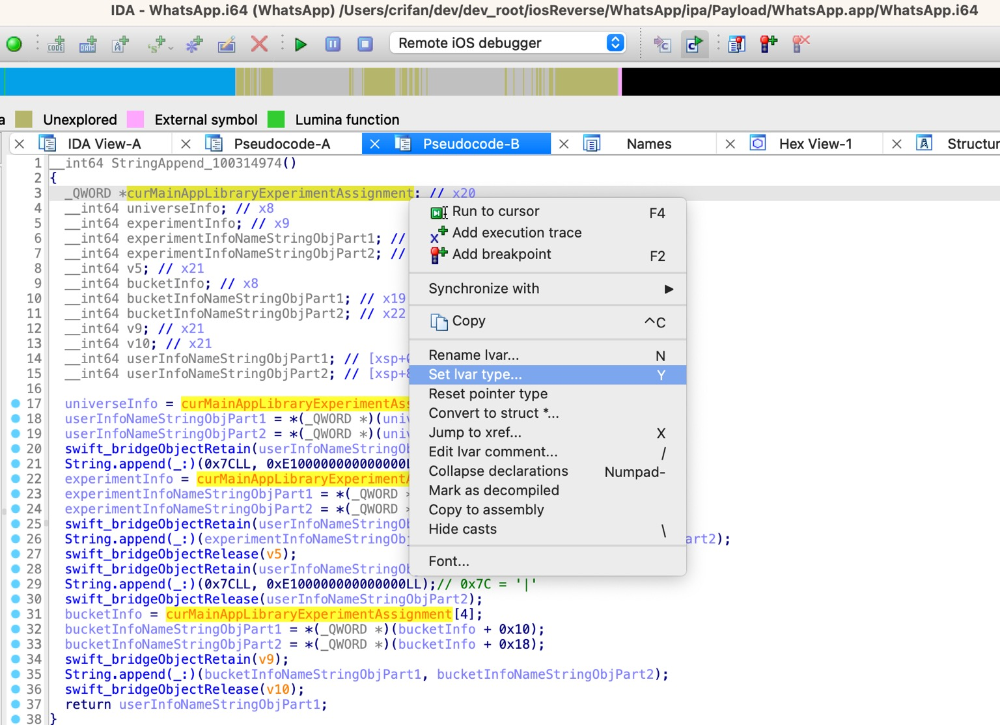


从：

* `_QWORD *curMainAppLibraryExperimentAssignment`

改为：

* `_TtC14MainAppLibrary20ExperimentAssignment *curMainAppLibraryExperimentAssignment`

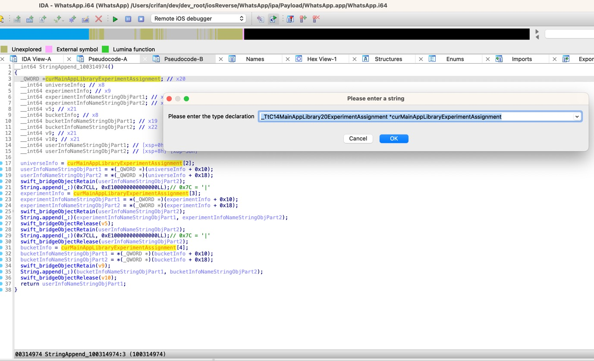

IDA中可见，的确自动识别成，类的属性=字段=成员的引用了：

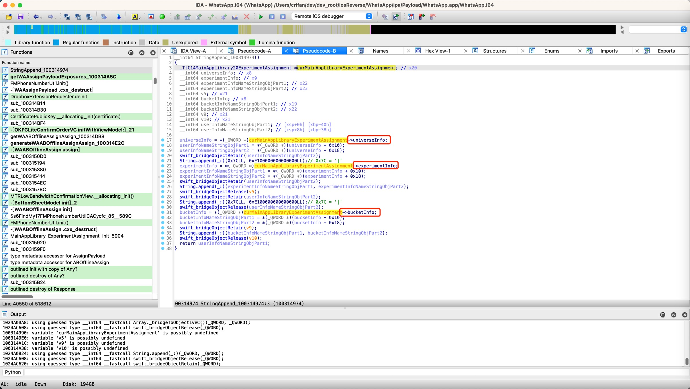

另外，再去给：

* universeInfo
* experimentInfo
* bucketInfo

也分别去修改类型为对应的类名：


* `__int64 universeInfo` -> `_TtCO14MainAppLibrary9OfflineAB12UniverseInfo* universeInfo`

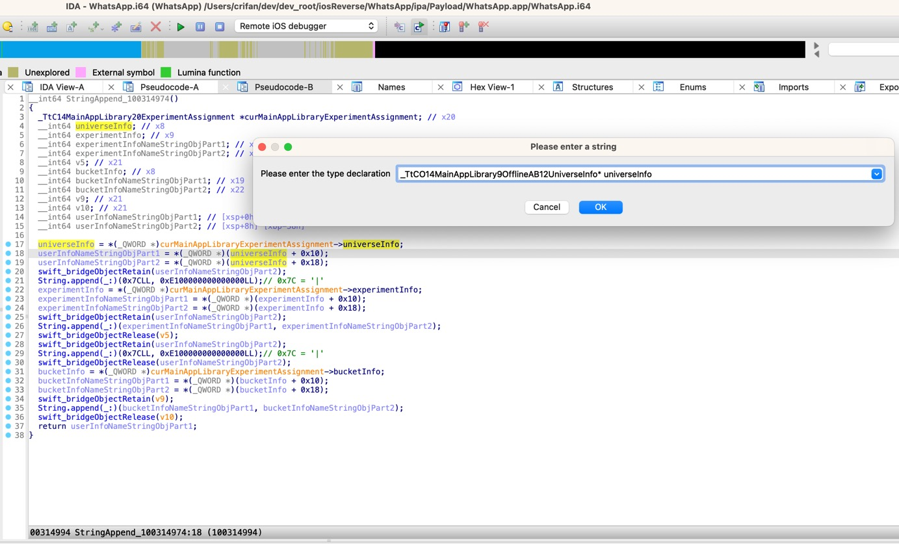

优化后的代码：

```c
__int64 StringAppend_100314974()
{
  _TtC14MainAppLibrary20ExperimentAssignment *curMainAppLibraryExperimentAssignment; // x20
  _TtCO14MainAppLibrary9OfflineAB12UniverseInfo *universeInfo; // x8
  _TtCO14MainAppLibrary9OfflineAB14ExperimentInfo *experimentInfo; // x9
  __int64 experimentInfoNameStringObjPart1; // x22
  __int64 experimentInfoNameStringObjPart2; // x23
  __int64 v5; // x21
  _TtCO14MainAppLibrary9OfflineAB10BucketInfo *bucketInfo; // x8
  __int64 bucketInfoNameStringObjPart1; // x19
  __int64 bucketInfoNameStringObjPart2; // x22
  __int64 v9; // x21
  __int64 v10; // x21
  __int64 userInfoNameStringObjPart1; // [xsp+0h] [xbp-40h]
  __int64 userInfoNameStringObjPart2; // [xsp+8h] [xbp-38h]


  universeInfo = *(_TtCO14MainAppLibrary9OfflineAB12UniverseInfo **)curMainAppLibraryExperimentAssignment->universeInfo;
  userInfoNameStringObjPart1 = *(_QWORD *)universeInfo->name;
  userInfoNameStringObjPart2 = *(_QWORD *)&universeInfo->name[8];
  swift_bridgeObjectRetain(userInfoNameStringObjPart2);
  String.append(_:)(0x7CLL, 0xE100000000000000LL);// 0x7C = '|'
  experimentInfo = *(_TtCO14MainAppLibrary9OfflineAB14ExperimentInfo **)curMainAppLibraryExperimentAssignment->experimentInfo;
  experimentInfoNameStringObjPart1 = *(_QWORD *)experimentInfo->name;
  experimentInfoNameStringObjPart2 = *(_QWORD *)&experimentInfo->name[8];
  swift_bridgeObjectRetain(userInfoNameStringObjPart2);
  String.append(_:)(experimentInfoNameStringObjPart1, experimentInfoNameStringObjPart2);
  swift_bridgeObjectRelease(v5);
  swift_bridgeObjectRetain(userInfoNameStringObjPart2);
  String.append(_:)(0x7CLL, 0xE100000000000000LL);// 0x7C = '|'
  swift_bridgeObjectRelease(userInfoNameStringObjPart2);
  bucketInfo = *(_TtCO14MainAppLibrary9OfflineAB10BucketInfo **)curMainAppLibraryExperimentAssignment->bucketInfo;
  bucketInfoNameStringObjPart1 = *(_QWORD *)bucketInfo->name;
  bucketInfoNameStringObjPart2 = *(_QWORD *)&bucketInfo->name[8];
  swift_bridgeObjectRetain(v9);
  String.append(_:)(bucketInfoNameStringObjPart1, bucketInfoNameStringObjPart2);
  swift_bridgeObjectRelease(v10);
  return userInfoNameStringObjPart1;
}
```

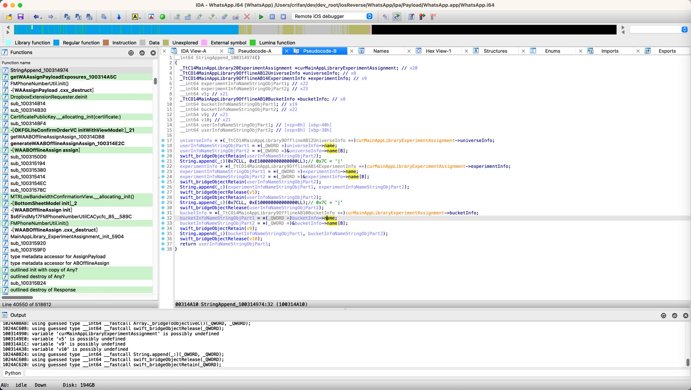

